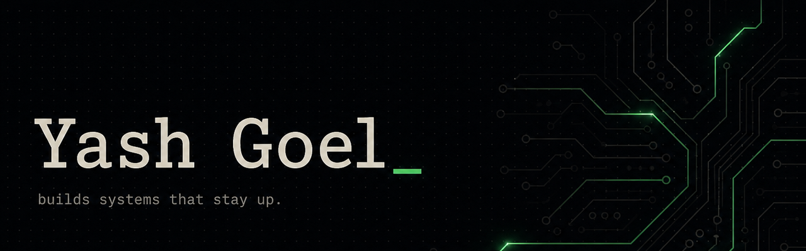

<div align="center">
  
</div>

<br />

<div align="center">

  `● SYSTEM ONLINE` &nbsp;·&nbsp; `svc: yash-goel.backend` &nbsp;·&nbsp; `net: NSUT · Delhi`

  

  <br />

  [](https://yashgoel1331.github.io/)
  [](https://www.linkedin.com/in/yash-goel-22b952283/)
  <a href="mailto:yashgoel31105@gmail.com"></a>
  [](https://yashgoel1331.github.io/)

</div>

---

Backend engineer working where **reliability is the feature** — FastAPI services, PostgreSQL at scale, Kubernetes operations, and observable LLM pipelines. I care about the unglamorous parts: latency, schema design, and tracing that makes 2 a.m. debugging survivable.

Currently shipping production backends at **Flywheel** for [**Sarlaben**](https://yashgoel1331.github.io/) — Amul's multilingual AI chat + voice assistant for farmers.

```
role      Backend Engineer · Flywheel
study     B.Tech ICE · NSUT Delhi · 2023–present
focus     APIs · data models · LLM telemetry · cluster ops
looking   SDE / internship · 2026 · backend, full-stack, platform
```

## now

- Unifying **chat + voice** into one FastAPI surface (≈40% less duplicate code)
- Owning **Langfuse** tracing across LLM workflows so failures are visible, not mysterious
- Running **Kubernetes** node lifecycle, autoscaling, and scheduling (cordon / drain / taints)
- Tuning **PostgreSQL** paths — 2,000+ glossary entries, ~30% lower query latency

## production

Shipped on Amul AI's chat + voice stack — milk-collection lookups, vet / AI-technician booking, and a 5-turn non-meaningful call-termination gate that hangs up instead of looping the full LLM pipeline.

| signal | value |
| :--- | :--- |
| query latency | **~30%** down |
| duplicate backend code | **40%** removed |
| milk / payout lookups | **1,200+** in production |
| call bookings | **650+** in production |
| graceful hangups | **500+** (≈ $0.40–$0.50 saved per avoided loop) |
| glossary entries | **2,000+** with live updates, no redeploy |

## selected systems

| | | |
| :--- | :--- | :--- |
| **[RBAC Banking](https://github.com/yashgoel1331/rbac_banking)** | JWT + DB-backed permissions on FastAPI / PostgreSQL. Roles can grow without a schema rewrite; authz is revalidated on the request, not just baked into the token. | `Python` `FastAPI` `PostgreSQL` `RBAC` |
| **[Duolingo Clone](https://github.com/yashgoel1331/Clone-Duolingo)** | Full-stack learning path: lessons, XP / hearts / streaks, weekly leaderboard. Next.js frontend, FastAPI + Alembic backend. [Live demo](https://frontend-six-alpha-86.vercel.app/). | `TypeScript` `Next.js` `FastAPI` |
| **[amul-oan-api](https://github.com/yashgoel1331/amul-oan-api)** · **[voice-oan-api](https://github.com/yashgoel1331/voice-oan-api)** | OpenAgriNet stack for Amul — conversational chat + voice APIs, farmer tools, moderation, translation pipelines. | `Python` `LLM` `Langfuse` |
| **[session_resolver](https://github.com/yashgoel1331/session_resolver_langfuse_flywheel)** | Session / trace resolution against Langfuse — the debugging layer around production LLM traffic. | `Python` `Langfuse` |
| **[adaptive-dsa-planner](https://github.com/yashgoel1331/adaptive-dsa-planner)** | Planner that adapts DSA practice instead of dumping a static sheet. | `JavaScript` |

More context, writeups, and the Objection / Orbit builds: **[yashgoel1331.github.io](https://yashgoel1331.github.io/)**.

## stack

<p align="center">
  
</p>

<p align="center">
  
  
  
  
</p>

When LLM pipelines misbehave, I'd rather **read the trace** than guess.

## telemetry

<div align="center">
  
  
</div>

<div align="center">
  
</div>

<div align="center">
  <picture>
    <source media="(prefers-color-scheme: dark)" srcset="https://raw.githubusercontent.com/yashgoel1331/yashgoel1331/output/github-contribution-grid-snake-dark.svg" />
    <source media="(prefers-color-scheme: light)" srcset="https://raw.githubusercontent.com/yashgoel1331/yashgoel1331/output/github-contribution-grid-snake.svg" />
    
  </picture>
</div>

## connect

Open to **2026** software-engineering internships and full-time roles — backend, full-stack, or platform. If you're hiring for systems that need to stay up, I'd like to hear about it.

<p align="center">
  <a href="https://yashgoel1331.github.io/">portfolio</a>
  &nbsp;·&nbsp;
  <a href="mailto:yashgoel31105@gmail.com">yashgoel31105@gmail.com</a>
  &nbsp;·&nbsp;
  <a href="https://www.linkedin.com/in/yash-goel-22b952283/">linkedin/in/yash-goel</a>
</p>

<p align="center">
  <sub><code>uptime 100% · last deploy: now</code></sub>
</p>
